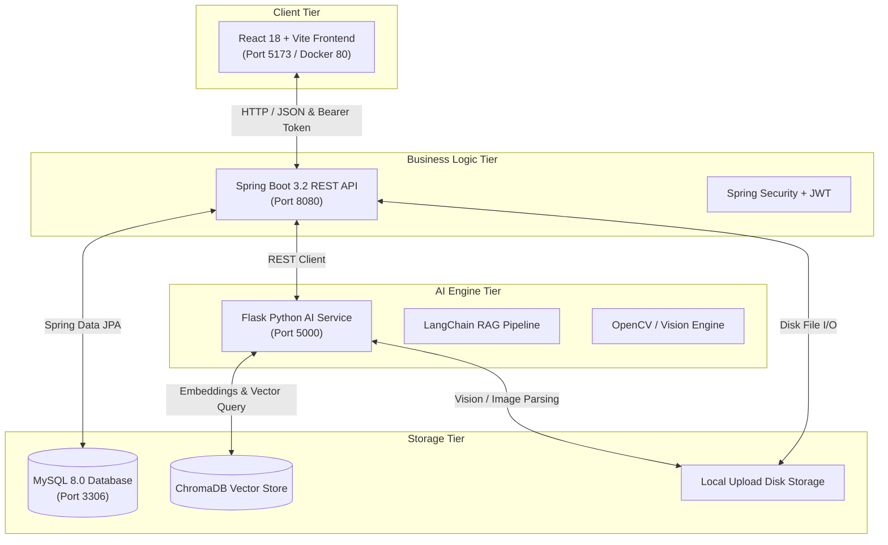

# AeroRAG — AI-Powered Intelligent Document Management & Knowledge Retrieval System

[](LICENSE)
[](frontend/README.md)
[](backend/README.md)
[](ai-engine/README.md)
[](backend/README.md)
[](ai-engine/README.md)
[](docs/DEPLOYMENT.md)

---

## 📌 Project Overview

**AeroRAG** is an enterprise-grade, multi-tier **AI-Powered Intelligent Document Management and Knowledge Retrieval System**. It bridges traditional relational document management with state-of-the-art **Retrieval-Augmented Generation (RAG)**, dynamic vector semantic search, OCR contract deadline extraction, multi-modal image analysis, and specialized circuit diagram blueprint parsing.

Designed for modern enterprise teams, engineers, legal professionals, and department administrators, AeroRAG enables seamless document upload, automated chunk indexing, contextual Q&A, and fine-grained role-based security across departments.

---

## 🚀 Key Features

### 📄 Document Management & Repository
* **Multi-Format Storage**: Securely upload, store, and manage PDFs, text documents, image blueprints, and technical specifications.
* **Metadata & Tagging**: Dynamic category allocation (`Engineering`, `Legal`, `HR`, `Finance`, `Administration`), tag indexing, and version history tracking (e.g. `v1`, `v2`).
* **Instant Filtering & Search**: Instant full-text search, category filter, status filter (`APPROVED`, `PENDING`, `REJECTED`), bookmarking, and instant file previews.
* **Document Lifecycle**: Complete approval workflow for managers and admins with inline document version updates.

### 🤖 AI Engine & RAG Retrieval
* **RAG Document Chat**: Contextual question-answering powered by local embeddings and LLM reasoning locked directly to selected or uploaded documents.
* **Semantic Explorer**: Vector similarity search using **ChromaDB** to find relevant concepts across large document stores.
* **AI Summarization**: Automatic generation of key bullet points, executive summaries, and structured takeaways.
* **Contract Deadline Extractor**: Automated OCR and text parsing to detect contract deadlines, expiration dates, and key milestone schedules.
* **Multi-Modal Vision & Circuit Analysis**: Computer vision pipeline to inspect images, component topologies, Op-Amp schematics, VCC/GND paths, and technical schematics.

### 🔒 Enterprise Governance & Security
* **JWT Authentication**: Stateless authentication with encrypted tokens and configurable token expiration.
* **Role-Based Access Control (RBAC)**: Enforced permission boundaries across `ADMIN`, `MANAGER`, and `EMPLOYEE` roles.
* **Department Isolation**: Fine-grained access control ensuring department managers oversee their respective departmental documents.
* **Security Audit Logs**: Comprehensive real-time event tracking recording all user logins, document uploads, downloads, approvals, and AI request logs.
* **Analytics Dashboard**: Real-time visual metrics displaying user counts, total document uploads, storage consumption, category distribution, and system activity.

---

## 🏗 System Architecture

The following diagram illustrates the complete end-to-end data flow across the enterprise stack:



### Complete End-to-End Data Flow
1. **User Interaction**: Users interact with the sleek React frontend (Material UI v5 + Tailwind/Glassmorphism design).
2. **API & Security**: Requests flow to the Spring Boot REST API. Spring Security validates JWT tokens and enforces `@PreAuthorize` role rules.
3. **Relational Persistence**: Users, departments, document metadata, audit logs, and approval statuses are stored in **MySQL 8.0**.
4. **AI & Vector Indexing**: When documents are processed for AI analysis, Spring Boot delegates tasks to the **Python Flask AI Engine**.
5. **RAG & Vision Processing**: Flask converts text blocks into high-dimensional vector embeddings using **LangChain** and indexes them into **ChromaDB**. Image and schematic requests trigger custom computer vision and Gemini Pro multi-modal analysis.

---

## 🛠 Technology Stack

| Layer | Component | Technologies Used |
| :--- | :--- | :--- |
| **Frontend** | UI & Single Page Application | React 18, Vite, Material UI (MUI v5), Lucide Icons, Framer Motion, Axios, React Query |
| **Backend** | REST API & Core Governance | Spring Boot 3.2, Java 17, Spring Security, JWT (JJWT), Spring Data JPA, Hibernate |
| **AI Engine** | Intelligence & RAG Pipeline | Python 3.10, Flask, LangChain, ChromaDB, OpenCV, PyPDF2, Google Gemini Pro API |
| **Database** | Relational & Vector Storage | MySQL 8.0 (Relational Metadata & Audit Logs), ChromaDB (Persistent Vector Store) |
| **DevOps & Infrastructure** | Containerization & Orchestration | Docker, Docker Compose, Multi-Stage Builds, Nginx (Production Static Hosting) |

---

## 📁 Repository Structure

```
RAG/
├── ai-engine/                  # Python Flask AI Engine & Vector DB Subsystem
│   ├── api/                    # REST Blueprint Controllers (chat, summary, vision, etc.)
│   ├── core/                   # Embeddings, RAG engine, Gemini model bindings
│   ├── services/               # Document processing & computer vision services
│   ├── uploads/                # AI execution temporary storage
│   ├── vectordb/               # ChromaDB persistent vector database store
│   ├── app.py                  # Main Flask application entrypoint
│   ├── config.py               # Centralized Python environment configuration
│   ├── requirements.txt        # Python dependency manifest
│   └── Dockerfile              # Python 3.10 multi-stage container build
├── backend/                    # Spring Boot REST API Subsystem
│   ├── src/main/java/          # Java enterprise packages (Controllers, Entities, Repos, Services)
│   ├── src/main/resources/     # application.yml configuration & static resources
│   ├── pom.xml                 # Maven project definition & dependencies
│   ├── .env                    # Backend local environment configuration
│   └── Dockerfile              # JDK 17 multi-stage container build
├── frontend/                   # React + Vite Single Page Application Subsystem
│   ├── src/                    # Components, views, contexts, services, and theme system
│   ├── nginx.conf              # Nginx production web server reverse-proxy configuration
│   ├── package.json            # npm package manifest
│   ├── vite.config.js          # Vite build & dev-server configuration
│   └── Dockerfile              # Nginx multi-stage static asset container build
├── docs/                       # Project System & Deployment Documentation
│   ├── DEPLOYMENT.md           # Enterprise Production Deployment Guide
│   ├── QA_TEST_REPORT.md       # Pre-flight QA & Build Verification Matrix
│   └── production_audit.md     # Production Readiness & Security Audit Report
├── docker-compose.yml          # Multi-container orchestration (4 services: mysql, ai-engine, backend, frontend)
├── .env.example                # Root environment template
├── .gitignore                  # Global Git exclusion filters
├── LICENSE                     # MIT License
└── README.md                   # System Architecture & Quickstart Guide (This File)
```

---

## ⚡ Quickstart & Setup Instructions

### Prerequisites
* **Java**: JDK 17 or higher
* **Node.js**: Node v18 or higher & `npm`
* **Python**: Python 3.10 or higher
* **Database**: MySQL Server 8.0 running locally on port 3306 (or via Docker)
* **Docker Desktop**: (Optional, for containerized execution)

---

### Method 1: Local Development (Host Machine)

#### Step 1: Clone Repository
```bash
git clone https://github.com/your-org/RAG.git
cd RAG
```

#### Step 2: Configure Environment Variables
Copy `.env.example` files to `.env` in each respective subsystem:
```bash
cp .env.example .env
cp backend/.env.example backend/.env
cp frontend/.env.example frontend/.env
cp ai-engine/.env.example ai-engine/.env
```
Ensure `backend/.env` contains your local MySQL password (`SPRING_DATASOURCE_PASSWORD=your_mysql_password` or your local root password) and `ai-engine/.env` has your `GEMINI_API_KEY`.

#### Step 3: Start AI Engine (Python Flask)
```bash
cd ai-engine
python -m venv venv
# On Windows PowerShell:
.\venv\Scripts\Activate.ps1
# On Linux/macOS:
source venv/bin/activate

pip install -r requirements.txt
python app.py
```
*AI Engine starts on `http://localhost:5000`.*

#### Step 4: Start Backend API (Spring Boot)
Open a new terminal:
```bash
cd backend
./mvnw spring-boot:run
# Or on Windows PowerShell:
.\mvnw.cmd spring-boot:run
```
*Backend starts on `http://localhost:8080` (automatically seeds initial database records on first run).*

#### Step 5: Start Frontend Application (React + Vite)
Open a new terminal:
```bash
cd frontend
npm install
npm run dev
```
*Frontend dev server starts on `http://localhost:5173`.*

---

### Method 2: Docker Setup (Recommended for Production)

Run the complete multi-tier enterprise stack with a single command using Docker Compose:

```bash
# Clone and enter directory
git clone https://github.com/your-org/RAG.git
cd RAG

# Create environment files
cp .env.example .env

# Build and start all 4 services
docker compose up --build
```

#### Docker Services & Default Ports

| Service Name | Container Image | Host Access URL | Description |
| :--- | :--- | :--- | :--- |
| `frontend` | Nginx Alpine (React Build) | `http://localhost:5173` (or `http://localhost:80`) | Web Application Console |
| `backend` | OpenJDK 17 Slim | `http://localhost:8080` | Spring Boot Enterprise REST API |
| `ai-engine` | Python 3.10 Slim | `http://localhost:5000` | Flask AI Engine & ChromaDB Store |
| `mysql` | MySQL 8.0 | `localhost:3306` | Relational Database Engine |

---

## 🔑 Environment Variables Matrix

AeroRAG relies on explicit environment variables for security. **Never commit `.env` files to source control.**

### Root Environment Variables (`.env`)
```ini
SPRING_DATASOURCE_PASSWORD=rootpassword
GEMINI_API_KEY=your_gemini_api_key_here
JWT_SECRET=your_base64_encoded_jwt_secret_here
```

### Backend Environment Variables (`backend/.env`)
```ini
SPRING_DATASOURCE_URL=jdbc:mysql://localhost:3306/rag_db?createDatabaseIfNotExist=true&useSSL=false&allowPublicKeyRetrieval=true&serverTimezone=UTC
SPRING_DATASOURCE_USERNAME=root
SPRING_DATASOURCE_PASSWORD=your_mysql_password
JWT_SECRET=your_base64_encoded_jwt_secret_here
AI_ENGINE_URL=http://localhost:5000
```

### AI Engine Environment Variables (`ai-engine/.env`)
```ini
FLASK_HOST=0.0.0.0
FLASK_PORT=5000
GEMINI_API_KEY=your_gemini_api_key_here
VECTOR_DB_PATH=./vectordb
UPLOAD_FOLDER=./uploads
```

---

## 👥 Default Demo Credentials

On startup, the system automatically seeds default system accounts for evaluation:

| Role | Username | Default Password | Access Level |
| :--- | :--- | :--- | :--- |
| **System Admin** | `admin` | `Admin@123` | Full access across all departments, audit logs, user management |
| **Engineering Manager** | `manager_eng` | `Manager@123` | Manager access for Engineering department & document approvals |
| **Legal Manager** | `manager_legal` | `Manager@123` | Manager access for Legal department & document approvals |
| **Engineering Employee** | `employee_eng1` | `Employee@123` | Standard upload, chat, search, and AI analytics |

---

## 📸 Screenshots & UI Tour

| Landing Page | Login Screen |
| :---: | :---: |
| *(Landing Page with features & tech stack overview)* | *(Secure JWT authentication login)* |

| Executive Dashboard | Document Repository |
| :---: | :---: |
| *(Real-time analytics, user counts, storage metrics)* | *(Grid view, filters, status chips, version updates)* |

| AI RAG Document Chat | Circuit Blueprint Analyzer |
| :---: | :---: |
| *(Contextual Q&A over uploaded technical PDFs)* | *(Schematic topology parsing & Op-Amp detection)* |

---

## 👥 Team Collaboration Guide

Follow standard Git flow guidelines when contributing:

1. **Clone & Setup**:
   ```bash
   git clone https://github.com/your-org/RAG.git
   cd RAG
   ```
2. **Create Feature Branch**:
   ```bash
   git checkout -b feature/amazing-ai-feature
   ```
3. **Commit Changes**:
   ```bash
   git commit -m "feat(ai): add multi-file batch summarization endpoint"
   ```
4. **Push & Open Pull Request**:
   ```bash
   git push origin feature/amazing-ai-feature
   ```

---

## 🔮 Future Enhancements

* **Kubernetes Orchestration**: Helm charts and K8s manifests for enterprise autoscaling.
* **Multi-LLM Provider Support**: Native integration with local Ollama, Llama-3, and Anthropic Claude.
* **Mobile Companion App**: Native iOS and Android application built with React Native.
* **Advanced Document Redaction**: Automatic PII and confidential text redaction prior to vector indexing.

---

## 📜 License

This project is licensed under the MIT License — see the [LICENSE](LICENSE) file for details.
